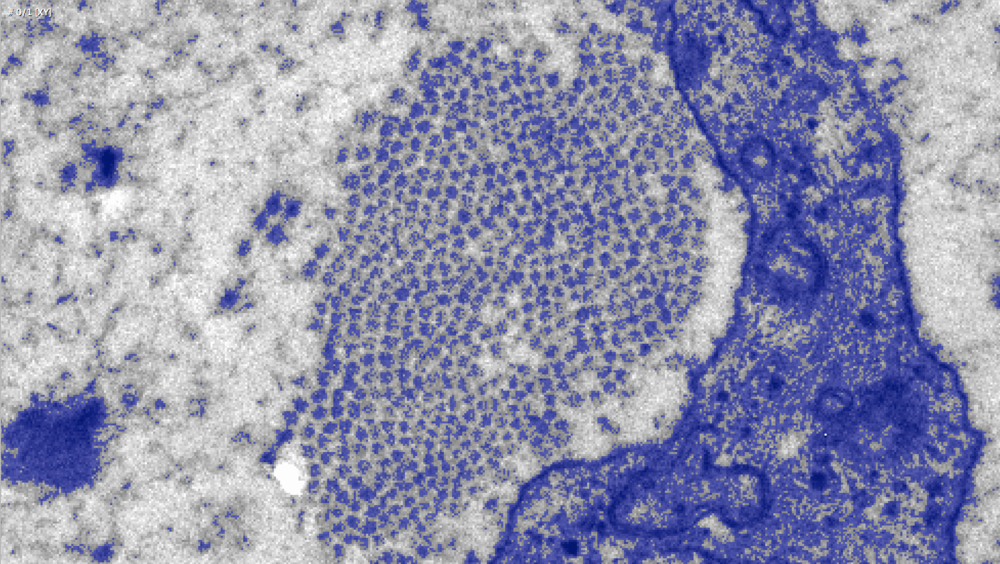
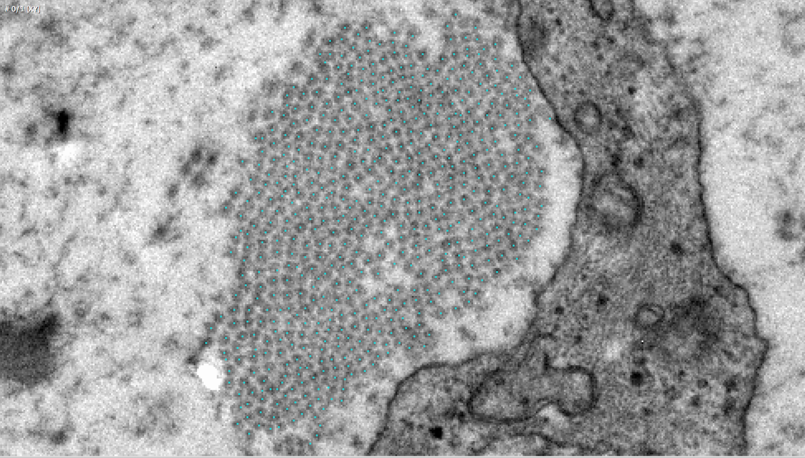
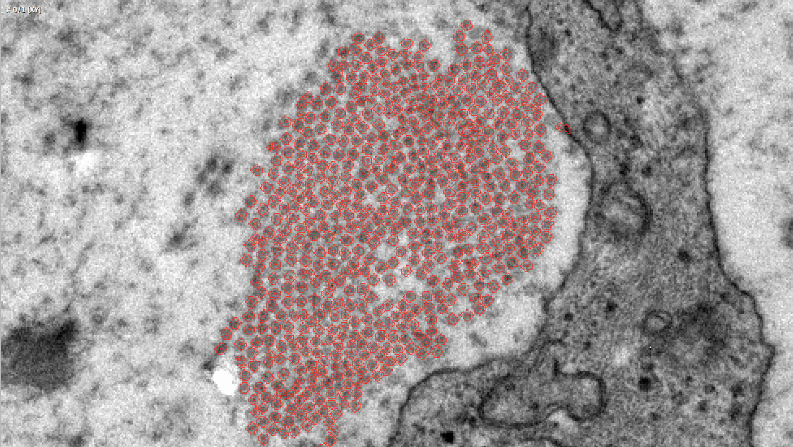

# fibril_segmentation
Algorithm for segmenting transmission electron microscopy (TEM) mitral valve interstitial cell (MVIC) images
developed at the 2015 Moncrief Internship, Center for Cardiovascular Simulation, Institute of Computational Engineering and Sciences

The algorithm is broken into three steps:

(1) The first step is a straightforward thresholding, where the input image is transformed into a binary image depending on the image intensity with regards to an intensity threshold. Thresholding is highly imperfect, and creates as many well-segmented fibrils as it does poorly-segmented. Namely, it creates two types of the latter: those that are overthresholded, which fuse with multiple neighboring fibrils, and those that are underthresholded, which separate into many unconnected regions.

Result of thresholding step, captured in Amira

(2) The second step uses a combination of a simplified normalized cut algorithm (as seen in <i>Normalized Cuts and Image Segmentation</i>, Shi and Malik, 2010), complemented by a convolution operation, to find the approximate centroids of the fused, overthresholded regions, and the separated, underthresholded regions, respectively, as well as those of the well-segmented regions.

Result of centroid-finding algorithm, captured in Amira

(3) Finally, the third step is a simultaneous region-growing algorithm, where each region is seeded by the centroids of the previous step, and then grown at the same time. Since the fibrils exist very close to each other, the algorithm can inform its region growth by simply the proximity of neighboring regions (i.e., when regions bumped into each other, they have finished growing). By thresholding the growth of all regions to stop after a certain fraction of regions have finished, the algorithm allows the image to naturally segment itself.

Result of region-growing algorithm, captured in Amira

Included in this directory are as follows (listed alphabetically):

	Cell1-01.am

	Cell1-01.Labels.am

	CheckNeighbors.m

	CountArea.m

	CutRegions.m

	FibrilSegmentationDemo.m

	FindCC_RegionProps.m

	FindOptimalCut.m

	FindRegions.m

	FindSliceAreas.m

	GrowRegionsMean.m

	GrowRegionsMin.m

	HighlightRegions.m

	LabelAreas.m

	LabeSlice.m

	LoadData_Amira.m (by Shawn, 2012: http://www.mathworks.com/matlabcentral/fileexchange/39235-load-amira-5-2-2-files)

	permn.m (by Jos, 2015: http://www.mathworks.com/matlabcentral/fileexchange/7147-permn-v--n--k-)

	SaveData_Amira.m

File Descriptions:

	Cell1-01.am

		Image data of the first slice in the data set provided by Salma

	Cell1-01.Labels.am

		Manually thresholded label data from Amira

	CheckNeighbors.m

	 	Helping function for CutRegions. For a particular large region and cut, finds all neighbors of each pixel along the cut.
		This allows the determination of the edges affected by the cut.

	CountArea.m

		Helping function for FindSliceAreas. Counts the area of an individual slice.

	CutRegions.m

		Helping function for FindRegions. Given the large region fibril threshold data, finds the optimal cut for each region and returns the resulting image.

	FibrilSegmentationDemo.m

		Demos the entire automated component of the Fibril Segmentation workflow.

	FindCC_RegionProps.m

		Given an image and connectivity, returns the connected components and region properties data structure.

	FindOptimalCut.m

		Helping function for CutRegions. Given the slice areas and edge numbers for a region along the cut orientation, and some other information, returns the location of the optimal cut that splits the region into two fibrils.

	FindRegions.m

		Given thresholded label data, groups separated connected components or cuts fused components until a meaningful
		segmentation of the fibrils is created.

	FindSliceAreas.m

		Helping function for CutRegions. Counts the areas of each slice of a region given the cut orientation.

	GrowRegionsMean.m

		Region growing algorithm that, given the fibril centroids, returns a segmentation of the original slice image of the fibrils themselves. This particular algorithm picks suitable new pixels for each region by its similarity to the regional mean.

	GrowRegionsMin.m

		Region growing algorithm that, given the fibril centroids, returns a segmentation of the original slice image of the fibrils themselves. This particular algorithm picks suitable new pixels for each region by its intensity. The intuition is the fibrils are lower intensity (darker) than their backgrounds.

	HighlightRegions.m

		Given linear indices of the pixels in an image, highlights them with a specified value. This is more useful for debugging. However, it is also used in FindRegions.

	LabelAreas.m

		Helping function for CutRegions. For a given region, it labels the areas of the resulting partitions dictated by the optimal cut.

	LabeSlice.m

		Helping function for LabelAreas. Given a slice location and orientation, labels one slice of the entire region.

	LoadData_Amira.m

		Loads Amira files for use in MATLAB. Outputs a header data structure and an image array.

	permn.m

		Using two input variables V and N, M=permn(V,N) returns all permutations of N elements taken from the vector V, with repetitions.

	SaveData_Amira.m

		Saves an image array as an Amira-compatible raw file with the given filename and file type.
